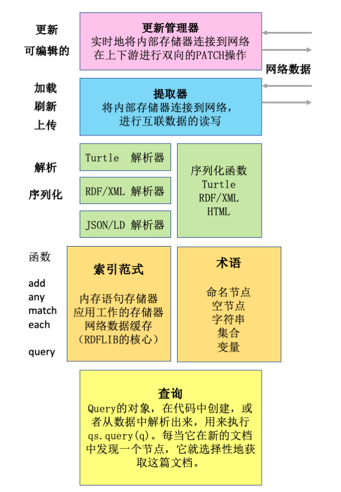

# 用 rdflib.js 操作互联数据


## RDFLIB 是什么

在 SoLiD 中，处理互联数据的最简易的方式就是使用一个叫 `rdflib` 的库。`rdflib` 是一个通用的工具箱，用来处理大部分和互联数据相关的事情。它可以用来存储数据、将数据序列化成各种格式、解析序列化后的数据，以及跟踪来自前后端的数据变动。

## 术语表

这里是我们接下来在文档中将会使用的一些术语。

* **存储器 (Store)：** 用来存储图状数据并可以对其进行查询的数据结构。这是在 `rdflib` 中处理互联数据最简单的方式。你可以用 Javascript 来存储数据、取出数据或者执行一些手动的查询。
* **提取器 (Fetcher)：** 一种用来连接到互联网、存取数据的辅助对象。它比简单的存储对象更强大一些，当你使用提取器遍历网络的时候，查询引擎会自动从互联网上提取互联数据。
* **更新管理器 (UpdateManager)：** 另一种辅助对象。更新管理器让你能够发送小的变更给服务器，来让服务端的数据和用户的操作实时同步。它也让你可以订阅多个用户对同一文件的操作，保持上下游数据同步，并在出现冲突的时候提示用户。
* **图 (Graph)：** 为语义网设计的一个数据库。这个数据库中的节点与节点之间的关联是比较任意的，里面没有父节点或者根节点的概念，并且节点之间的联系都是键。
* **三元组 (Triples)：** 资源描述框架 (RDF) 里的一个概念，它由主语、谓词、宾语构成。例如，当你要存储『我的名字是王五』的时候，你就会把它表示成一个三元组。
* **四元组 (Quad)：** 和三元组类似，只不过多了一个属性来表示这个数据的来源。
* **语句 (Statement)：** 四元组的别名。

## 配置rdflib.js

大家习惯在代码模块中把 `rdflib` 定义成 `$rdf`，因为这样你就可以比较轻松地复制粘贴这里的代码，也方便参考别的项目的代码，并且不容易产生歧义。

我们用`npm`来安装这个库：

```shell
npm install rdflib --save
```

然后在你的代码里这样使用它（ES6 写法）：

```javascript
const $rdf = require(‘rdflib’)
```

## 创建存储器

如果我们有了一个存储，然后我们想要存入一个人和他的个人档案（profile），这个人的 WebID 是 URI `https://example.com/alice/card#me`，它是文件 `https://example.com/alice/card` 中的一个局部变量 `me`。

有两种方式来创建**存储器**，比如：

```javascript
const store = new $rdf.IndexedFormula();
```

还有简写方式：

```javascript
const store = $rdf.graph();
```

## 使用存储器

首先，我们来给这人创建一个变量，同时给他的个人资料也创建一个变量。你会注意到资源描述框架中用来表示抽象事物的 URI 后面都有个井号 `#` 和一个局部 id，这其实就是 HTML 中的锚点的用法。然后，我们使用命名节点函数 `doc()` 为文档生成一个命名节点 (NamedNode) 。

```javascript
const me = store.sym('https://example.com/alice/card#me');
const profile = me.doc(); //i.e. store.sym(''https://example.com/alice/card#me')
```


接下来我们想要使用*电子名片* (vCard)，于是我们用一个**命名空间**对象来为电子名片中每一个条目生成正确的谓词URI。

```javascript
const VCARD = new $rdf.Namespace(‘http://www.w3.org/2006/vcard/ns#‘);
```

如果我们不知道要用哪些词语，各个社区有他们偏好的词语列表供我们选择；比如其中一个就是 [`solid-ui`](https://github.com/solid/solid-ui/blob/master/src/ns.js) 的命名空间列表。


接着，我们将存储在个人资料中的姓名添加到**存储器**中

```javascript
store.add(me, VCARD(‘fn’), “John Bloggs”, profile);
```

* 第三个参数，也就是宾语，严格地说应该传入一个**资源描述框架**形式的内容，而上述例子中直接填写了字符串 `"John Bloggs"` 。但这并不影响使用——当你填入像 `“John Bloggs”` 这样的字符串时，`rdflib` 会自动在函数内部将其转换成正确的表示形式。除此以外，数字、JavaScript Date 对象也都能够在函数内部被自动转换。


我们现在有一个**四元组**存放在我们的存储器中！ 让我们将它读取出来。

现在我们要查看此人在他个人资料中的姓名，可以这么做：

```javascript
let name = store.any(me, VCARD('name'), null, profile);
```

如果你不关心数据可能来自哪个文件，那么可以省略最后一个参数——实际上这个对象(`profile`)是个通配符：

```javascript
let name = store.any(me, VCARD('name'));
```

这时，你就可以从你已经加载的文件中提取出所有的姓名了。


到此为止，我们已经成功将三元组添加到了本地的**存储器**中，这其实是把**存储器**作为一个内存型数据库来使用。在 SoLiD 应用中，我们将上述这种方法作为在Web上获取和保存数据的主要方式。

### 在存储器中使用 Turtle

接下来让我们一起看看另外两个本地操作**存储器**的例子。

如果你有一些用 turtle 写的数据，可以使用 `$rdf.parse` 将其加载到**存储器**中：

```javascript
let text = '<#this>  a  <#Example> .';

let doc = $rdf.sym("https://example.com/alice/card");
let store = $rdf.graph();
$rdf.parse(text, store, doc.uri, 'text/turtle');  // pass base URI
```

请注意，你必须指定一个文档的统一资源定位符 (URI)。这是因为**存储器**通过跟踪每个三元组所属的文档来工作。

```javascript
> store.toNT()
'{<https://example.com/alice/card.ttl#this> <http://www.w3.org/1999/02/22-rdf-syntax-ns#type> <https://example.com/alice/card.ttl#Example> .}'
```

类似地，我们可以用`serialize()`函数从**存储器**中序列化生成 turtle 文本。只要将文档作为命名节点传给 `serialize()` 函数，它就会从该文档中选择三元组作为序列化的输出。

```javascript
console.log($rdf.serialize(doc, store, aclDoc.uri, 'text/turtle'));
```

如果你省略序列化函数 `serialize` 的第一个参数 `doc` ，或者将其设置为 `null` ，那么你将得到**存储器**中的所有的三元组。这时，如果你使用了提取器，有可能得到一堆提取器中的元数据。这些元数据是提取器在发出HTTP请求获取文档时储存的。这也许很有趣，但最后的结果决不会是你期望的那样。

### 用 `match()` 来搜索存储器

**存储器**的函数 `match(s, p, o, d)` 让你可以搜索出任何形式的四元组：

```javascript
let quads = store.match(subject, predicate, object, document);
```

* 任一个参数都可以为 `null`或`undefined`，这时它表示通配符，即「任意」。
* 返回的四元组是**语句**对象的数组。

一些`match()`函数的调用例子：(Examples:)

| `match()`调用方式 | 函数功能描述 |
| :--: | :--: |
| `match()`| 给出**存储器**中的所有**语句** |
| `match(null，null，null，doc)` | 给出文档中的所有**语句** |
|`match(me，null，null，me.doc())`| 给出在我的个人资料中的，以我作为主语的所有**语句** |
| `match(null，null，me，me.doc())` | 在我的个人资料中的，以我作为宾语的所有**语句** |
| `match(null，LDP('contains'))`   | 给出谓词为 `ldp：contains` 的所有**语句** |

在你取出一组**语句**之后，你通常还会想要查看这组**语句**的**属性**。**语句**有如下这些**属性**：

| 属性名称 | 属性描述 |
| :-:     |  :-:    |
| 主语   | 主语的节点     |
| 谓词   | 谓词的命名节点  |
| 对象   | 主语的节点     |
| 为什么 | 文档的命名节点  |

最后一个属性之所以被称为「*为什么*」，是因为它告诉我们为什么我们应该相信它。 在一个简单的互联数据系统中，它是我们读过的一篇文档。在更复杂的系统中，这可能指向推理步骤。它也可以是提取器放入的一个特殊对象，用于把所有 HTTP 操作的结果存储到 Web 上。


因此，如果你要找出所有宾语是某个被 albert 弃用了的邮件地址的文档，可以这么做：

```javascript
let oldEmail = $rdf.sym('mailto:albert@example.com');
let outOfDate = store.match(null, null, oldEmail, null).map(st => st.why);
```

注意：我们用通配符来搜索所有陈述，且只保留询问「为什么」的部分。

因此，如果想找出所有把 Alice 作为主语或者宾语的语句，你可以这么做：

```javascript
let mentions = store
  .match(alice, null, null, null)
  .concat(store.match(null, null, alice, null))
  .map(st => st.why);
```

注意：我们也可以用这个方便的写法：

```javascript
let aboutAlice = store.connectedStatements(alice, alice.doc());
```

这会加载所有提及到 Alice 的语句，加上那些提到链接到其他内容的空白节点，它们可能会关联到像 Alice 的地址之类的信息。

假设我们已经加载了一大堆 LDP 里的文件夹，我们现在想要加载所有文件对，约束是其中一个装在另一个里面：

```javascript
store.match(null, LDP(‘contains’)).forEach(st => {
  console.log(st.subject + ‘ contains + st.object)
});
```

我们之所以在介绍函数 `any()` 和 `each()` 之后才介绍 `match()` ，是因为我们在编程过程中发现用 `any()` 和 `each()` 要比使用 `match()` 更方便。


### 生成新的语句

你可以通过以下代码来生成新的语句：

```javascript
let st = new $rdf.Statement(me, FOAF(‘name’), “Joe Bloggs”, me.doc());
```

要是你觉得上面的代码太累赘，你可以换一种相对简便的格式：

```javascript
let st = $rdf.st(me, FOAF(‘name’), “Joe Bloggs”, me.doc());
```

上述代码中 `st` 这种格式的原理是，你可以将待删除或插入的语句的数组传递给**更新管理器**的 `update()` 函数，来对 Web 上的数据进行一些小的修改。

在我们学习使用**更新管理器**之前，不妨先学习一下怎么使用**提取器**。因为**提取器**是网络互连的第一层工具，其次才是**更新管理器**。

## 使用提取器

**提取器**是一种辅助对象，它让你能够通过使用**存储器**来连接网络，并进行网络数据的读写。

**提取器**的功能：

* 响应 HTTP 请求，并且还能适配 MIME 及其他标准类型。
* 使用四列的语句存储来记录每一个三元组的来源。
* 解析网络上（或者其他地方）的数据，并将解析后的数据放置在**存储器**中。
* 从**存储器**中生成相当美观的格式化数据



让我们先像之前那样建立一个**存储器**：

```javascript
const store = $rdf.graph();
const me = store.sym('https://example.com/alice/card#me');
const profile = me.doc() //    i.e. store.sym('https://example.com/alice/card#me');
const VCARD = new $rdf.Namespace('http://www.w3.org/2006/vcard/ns#');
```

接下来，我们为**存储器**生成一个**提取器**：

```javascript
const fetcher = new $rdf Fetcher(store);
```

然后，我们用**提取器**加载文档：

```javascript
fetcher.load(profile).then(response => {
   let name = store.any(me, VCARD(‘fn’));
  console.log(`Loaded {$name || ‘wot no name?’}`);
}, err => {
   console.log(“Load failed “ +  err);
});
```


特别的，当我们在和用户进行交互的时候，用户的姓名和个人头像是非常有用的。下面我们想要通过一种鲁棒的方法来获取用户的姓名和头像，避免我们的代码因为用户的个人资料的内容不同而失效。

```javascript
const FOAF = $rdf.Namespace('http://xmlns.com/foaf/0.1/');
```

这样我们就能够在没有电子名片时候，尝试上述的命名空间：

```javascript
let name = store.any(me, VCARD(‘fn’)) || store.any(me, FOAF(‘name’));
let picture = store.any(me, VCARD(‘hasPhoto’)) || store.any(me, FOAF(image));
```

或者我们可以跟踪我们找到的所有姓名。`each()` 函数返回它找到的所有满足条件的域的数组。

```javascript
let names = store.each(me, VCARD(‘fn’)).concat(store.each(me, FOAF(‘name’)));
```

### 使用提取器的完整例子

让我们为某人生成一个名片，并且让它在有网络链接的时候获取一张图片。我们在这个例子中使用的是最简易的 DOM（当然你也可以将其调整成你喜爱的 UI 框架）。

```javascript
const store = $rdf.graph();
const fetcher = new $rdf.Fetcher(store);
const me = store.sym('https://example.com/alice/card#me')

const VCARD = new $rdf.Namespace(‘http://www.w3.org/2006/vcard/ns#‘);
const FOAF = $rdf.Namespace('http://xmlns.com/foaf/0.1/');

function cardFor (person) {
	let div = document.createElement(div);
	div.outerHTML = `<div style = ‘padding: 0.5em;’>
	       
     	   <span style=’text-align: center;’>???</span>
        </div>
	`;
	let image = div.children[0];
	let span = div.children[1];

    store.load(person).then( response => {
	    let name = store.any(person, VCARD(‘fn’));
	    if (name) {
	    	label.textContent =  name.value; // name is a Literal object
        }

        let pic = store.any(person, VCARD(‘hasPhoto’));
	    if (pic) {
		    image.setAttribute(‘src’, pic.uri); // pic is a NamedNode
        }

    });
    return div;
}
```

在我们的网页应用中，我们运行下述命令：

```javascript
div.appendChild(card(me)); // My card

fetcher.load(me.doc).then(resp -> {
	store.each(me, FOAF(‘friend’)).forEach(friend => div.appendChild(card(friend)));
});
```

上述命令会加载用户的个人资料来生成名片需要的图片和姓名。接着，我们再一次加载用户数据来获取他的朋友列表。这是挺合理的，因为提取器的 `load()` 方法意思是“就绪即加载”，所以它一获取到数据，就继续之后的任务。在加载你需要的数据的同时，让系统追踪已经加载完毕的数据是非常明智的。

之后，对于该用户的每一个朋友，提取器都会去加载他的个人资料来获取他的姓名和头像，并将其对应填写在该用户名片的朋友一栏中。

> 提示：在 SoLiD 生态圈中，将页面上可拖动的内容表示成可拖动网址是非常好的。这就意味着你的UI用户能够将人们从你的窗口拖动到另外一个 SoLiD 应用中，能够将他们添加到一个组中，能够给他们一定的权限去访问相应内容等等。类似地，如果你的窗口状态的逻辑能够为用户们提供移除操作的话，你也可以把你的页面作为一个拖动的目标。上述这些情景至少对于可以有拖动和移出行为的设备是这样子的。


## 罗列数据

在资源描述框架中，任何内容的表示都是相同的。我们使用大致相同的方式来存储所有数据，仅仅是使用的词汇上有些许区别。假设你想要罗列某人 SoLiD 空间中一个文件夹的内容，这就像列举他们的朋友一样简单。文件夹内容的命名空间是互联数据协议。所以…

```javascript
const LDP = $rdf.Namespace(‘http://www.w3.org/ns/ldp#>’);

let folder = $rdf.sym(‘https://alice.example.com/Public/’);  // NOTE: Ends in a slash

fetcher.load(folder).then(() => {
	let files = store.any(folder, LDP(‘contains’));
	files.forEach(file) {
        console.log(‘ contains ‘ + file);
    }
});
```

SoLiD 容器给了你一些元数据，这些元数据中记录了它所包含的每一个文件的大小和类型。例如，我们可以通过查看资源描述框架的类型来知道我们什么时候可以把对应内容列成子目录。

```javascript
function list(folder, indent) {
    indent = indent || ‘’;
    fetcher.load(folder).then(() => {
		let files = store.any(folder,  LDP(‘contains’));
		files.forEach(file) {
            console.log(indent + folder + ‘ contains ‘ + file);
            if (store.holds(file,  RDF(‘type’), LDP(‘Container’)) {
	            list(file, indent + ‘   ‘);
            }
        }
    });
}


list(rdf.sym(‘https://alice.example.com/Public/’));
```

查询的结果是异步返回的。如果我们之前正在建立一个用户界面，每一个返回的结果都会到达正确的位置。

## 更新：使用更新管理器来更新网页

更新管理器是**存储器**的另一个辅助对象。就像提取器驱动**存储器**去读写网页上的资源那样（大体上是一次一个文件），更新管理器对象驱动**存储器**来对网页上的数据进行小的修改。同样地，更新管理器让网页应用订阅他人修改操作的流，并且让存储在不同服务器上的数据保持一致。

```javascript
const store = $rdf.graph();
const fetcher = new $rdf.Fetcher(store);
const updater = new $rdf.UpdateManager(store);

// ...

function setName(person, name, doc) {
  let ins = $rdf.st(person, VCARD('fn'), name, doc);
  let del = [];
  updater.update(del, ins, (uri, ok, message) => {
    if (ok) console.log('Name changed to ' + name);
    else alert(message);
  });
}
```

* 传递给 `update()` 函数的第一个参数是待删除语句的数组。当第一个参数为空数组时，`update()` 函数仅完成添加数据的操作。这里需要注意的是，用户只需要附加数据的权限，而不需要完全的写入权限。

* 传递给 `update()` 函数的第二个参数是待插入语句的数组。

```javascript
function modifyName(person, name, doc) {
  let ins = $rdf.st(person, VCARD('fn'), name, doc);
  let del = store.statementsMatching(person, VCARD('fn'), null, doc); // null是通配符
  updater.update(del, ins, (uri, ok, message, response) => {
    if (ok) console.log('Name changed to ' + name);
    else alert(message);
  });
}
```

所以，在上述例子中，函数 `modefiyName()` 会先找到给定姓名 `name` 的人的所有语句，然后使用 `update()` 将旧的语句从存储中删去，并添加新设置的语句。在这个例子中，实际效果就是更改了文档中人的姓名。

### 409冲突

需要注意的是，更新操作（它进行了 HTTP 的 PATCH 操作）在 SoLiD 中被规定为原子操作。也就是说，更新操作要么完成删除和插入语句的操作，要么就是失败或者什么也没做。当服务器无法删去一些语句的时候，更新操作会失败且伴随409冲突。比如说，服务器在要删除一些语句的时候，有其他人已经先于服务器删除了那些语句，这时候就会引起更新失败和409冲突。在这类情况下，网页应用通常会发出“嘟”的一声，或者界面会变成粉红色，然后退出用户尝试更新操作的页面。

## 删除资源

你可以使用上述介绍的更新管理器来删除数据源中的三元组或者三元组的组合。如果你想删除整个数据源，你可以使用 HTTP 的 `DELETE` 方法。

```javascript
store.fetcher.webOperation('DELETE', doc.uri).then(/*...*/);
```

### 递归地删除 SoLiD 文件夹

和Unix系统一样，你不能（目前是2018年）删除一个非空的文件夹。所以，如果你想要删除一个文件夹，你必须先将该目录下所有的内容删去。我们在这里介绍一个模拟 Unix 中 `rm -r` 功能的函数 `deleteRecursive()`。

```javascript
function deleteRecursive(store, folder) {
  return new Promise(function(resolve, reject) {
    store.fetcher.load(folder).then(function() {
      let promises = store.each(folder, ns.ldp('contains')).map(file => {
        if (store.holds(file, ns.rdf('type'), ns.ldp('BasicContainer'))) {
          return deleteRecursive(kb, file);
        } else {
          console.log('deleteRecirsive file: ' + file);
          if (!confirm(' Really DELETE File ' + file)) {
            throw new Error('User aborted delete file');
          }
          return store.fetcher.webOperation('DELETE', file.uri);
        }
      });
      console.log('deleteRecirsive folder: ' + folder);
      if (!confirm(' Really DELETE folder ' + folder)) {
        throw new Error('User aborted delete file');
      }
      promises.push(store.fetcher.webOperation('DELETE', folder.uri));
      Promise.all(promises).then(res => {
        resolve();
      });
    });
  });
}
```

请小心使用哦。

## 跟踪变动

使用上述介绍的更新管理器，我们能制作这样一个网页应用，只要它的用户界面发生变动，它就会把这些变动发送给数据源。我们不妨让它在数据源变动的时候，也能相应地改变用户界面。实现这个功能的函数如下：

```javascript
updater.addDownstreamChangeListener(doc, refreshFunction);
```

函数 `addDownstreamChangeListener()` 通过服务器打开一个 `websocket` 来发送和接收数据变动。当它接收到来自服务器的消息时，如果消息表明文档已经发生改变，它就会将文档重载进**存储器**中。即使你在很多地方都加载了同一个文档也没关系，它会帮你重载这些地方的文档。还有，它会忽略你自己用 `updater.update()` 做出的一些本地的变更。所以，你所要做的就是提供一个可以将存储中的变更同步到用户界面的函数，这样你就能够跟踪数据源的变动来相应地调整用户界面的内容了。

下面我们假设一个场景：用户并不在编辑你的用户界面，而只是在盯着这个界面看。你可以避免使用下面这段代码来刷新你的整个页面。

```javascript
const div = dom.createElement('div')
function refresh () { // 不推荐
  div.innerHTML = ''
  store.each(subject, predicate, null, doc).forEach(obj) {
    div.appendChild(renderOneObject(obj))
  }
}
refresh()
updater.addDownstreamChangeListener(doc, refresh)
```

因为上述代码会导致这个 DIV 组件被重新渲染。如果有一个过程并不像对界面内容进行增删操作的刷新函数那么华丽，那就意味着用户可以在编辑某一部分页面的时候，看到另一部分的页面内容发生改变。

```javascript
mugshotDiv = div.appendChild(dom.createElement('div'));

function elementForImage(image) {
  let img = dom.createElement('img');
  img.setAttribute('style', 'max-height: 10em; border-radius: 1em; margin: 0.7em;');
  img.setAttribute('src', image.uri);
  return img;
}

function syncMugshots() {
  let images = kb.each(subject, ns.vcard('hasPhoto'), null, doc);
  images.sort(); // arbitrary consistency
  images = images.slice(0, 5); // max number for the space
  UI.utils.syncTableToArray(mugshotDiv, images, elementForImage);
}

syncMugshots();
updater.addDownstreamChangeListener(doc, syncMugshots);
```

在上面的代码中，我们使用了一个简便的函数 `syncTableToArray()` 。它来自 `solid-ui` 命名空间，以下代码是它的具体实现。我们非常支持你制作出双向同步的用户界面，即使你可能并没有使用你常用的框架。所以，有能力的话，你可以用你最喜爱的框架来和 `rdflib` 相结合使用。如果在这个过程中，你觉得有困难，你可以参考[ Inrupt 的 SoLiD 文档](https://solid.inrupt.com/docs)来学习怎样在具体的 UI 框架中使用 `rdflib`。

```javascript
function syncTableToArray(table, things, createNewRow) {
  let foundOne, row, i;

  for (i = 0; i < table.children.length; i++) {
    row = table.children[i];
    row.trashMe = true;
  }

  for (let g = 0; g < things.length; g++) {
    var thing = things[g];
    foundOne = false;

    for (i = 0; i < table.children.length; i++) {
      row = table.children[i];
      if (row.subject && row.subject.sameTerm(thing)) {
        row.trashMe = false;
        foundOne = true;
        break;
      }
    }
    if (!foundOne) {
      let newRow = createNewRow(thing);
      // Insert new row in position g in the table to match array
      if (g >= table.children.length) {
        table.appendChild(newRow);
      } else {
        let ele = table.children[g];
        table.insertBefore(newRow, ele);
      }
      newRow.subject = thing;
    } // if not foundOne
  } // loop g

  for (i = 0; i < table.children.length; i++) {
    row = table.children[i];
    if (row.trashMe) {
      table.removeChild(row);
    }
  }
} // syncTableToArray
```

## 结论

到此为止，我们已经知道了怎样直接和**存储器**交互，并将它作为一个本地的内存型数据库使用；并且我们也了解了怎样用**存储器**去存取网页数据；我们也理解了它是怎样作为一个巨大互联网的本地缓存来保持用户层次的数据一致性。而作为开发者，我们现在已经可以编程来让用户们去探索、创建、修改以及连接网页上的互联数据。最后，我们相信SoLiD平台上将来会包含越来越多的域名，也将会诞生各式各样的应用。
