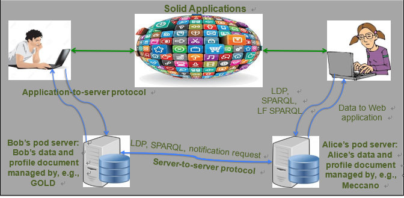
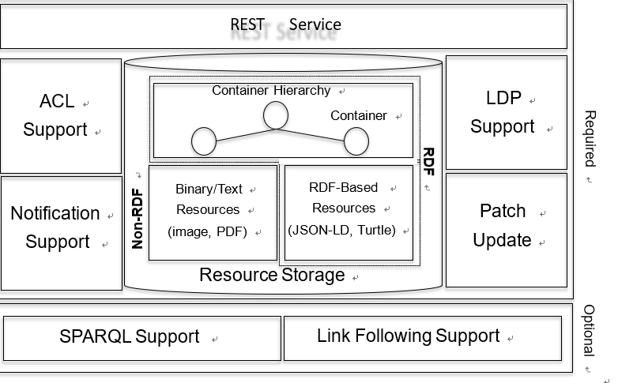
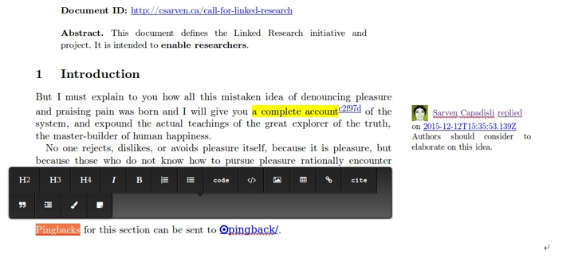

# SoLiD 具体技术细节

原文请参见：[http://crosscloud.org/2016/www-mansour-pdf.pdf](http://crosscloud.org/2016/www-mansour-pdf.pdf) 以下翻译仅供参考

## 面向社交 web 应用的实体平台演示

> Essam Mansour Andrei Vlad Sambra Sandro Hawke Maged Zereba
>  
> Sarven Capadisli Abdurrahman Ghanem Ashraf Aboulnaga Tim Berners-Lee
>  
> Qatar Computing Research Institute, HBKU
>  
> Decentralized Information Group, MIT CSAIL

## 诸论

solid 是社交 web 应用程序的分散平台。在 solid 平台中, 用户的数据独立于创建和使用此数据的应用程序进行管理。每个用户都将其数据存储在 web 可访问的个人在线数据存储区 (或 pod) 中。每个用户可以有一个或多个来自不同 pod 提供程序的 pod, 并且可以轻松地在提供程序之间切换。应用程序使用定义良好的协议访问用户 pod 中的数据, 分散的身份验证和访问控制机制保证了数据的隐私。在这种分散的体系结构中, 无论用户数据存储在何处, 应用程序都可以对其进行操作。用户控制对其数据的访问, 并可以随时在应用程序之间切换。我们将从最终用户和应用程序开发人员的角度演示 solid 的效用以及它是如何实现的。为此, 我们将使用一组 solid 服务器和使用这些服务器的多个 web 应用程序。我们相信, 使用 solid 这样的具体平台的经验对于真正了解分散的社交网络的力量非常有价值。

## 1. 介绍和背景

社交网络应用程序, 如 Facebook,Twitter,Doodle, Wikipedia, Craigslist，他们中多数将数据存储在可被视为 "数据孤岛" 的集中存储存储库中。每个应用程序 (或基于一个社交网络平台的一组应用程序) 控制自己的数据, 并且通常有自己的身份验证和访问控制机制。因此, 用户无法轻松地在允许重用其数据的类似应用程序之间切换, 也无法从一个数据存储服务切换到另一个数据存储服务。开发人员仅限于特定平台提供的数据访问 api, 并且无法轻松开发可在多个平台上运行的应用程序。这些和其他集中化的问题已经认识到很长时间了, 有许多关于 "重新下放" 社会网络的建议, [Diaspora](https://diasporafoundation.org), Musubi [3], and WebBox [10], 等。但这些建议都尚未被广泛通过,

---

 https://diasporafoundation.org Copyright is held by the author/owner(s). _WWW’16 Companion,_ April 11–15, 2016, Montréal, Québec, Canada. ACM 978-1-4503-4144-8/16/04. http://dx.doi.org/10.1145/2872518.2890529.

图一：_SoLiD 平台。用户将他们的数据存储在个人在线数据存储（pod）中，该个人在线数据存储驻留在 pod 服务器上。用户使用存储在其 pod 中的 RDFprole 文档控制他们的身份。要使用 SoLiD 应用程序，用户从应用程序提供程序加载应用程序。用户从应用程序提供程序加载应用程序。应用程序从用户的身份信息获取用户的 pod。然后，它遵循身份信息的链接来发现用户 pod 以及其他 pod 上的数据，并在需要时执行身份验证。_

---

---

权力下放平台的技术细节仍然是研究人员和从业人员调查的课题。例如, w3c 让社会网络工作组积极调查权力下放[标准](https://www.w3.org/Social/WG).

我们目前在这个空间的活动围绕着一个平台, 我们称之为 [solid](https://github.com/solid/solid) (Social Linked data) [7]。solid 平台支持分散的社交 web 应用程序, 尽可能依靠 w3c 标准和语义 web 技术来实现图 1 所示的体系结构。该平台指定图中所需的所有协议, 如身份验证、应用程序到服务器和服务器到服务器的通信。本演示展示了 solid 平台, 重点介绍了最终用户和应用程序开发人员的体验。特别是, 我们通过一组支持这些应用程序的应用程序和服务器来证明, solid 支持应用程序之间的高度互操作性、应用程序之间轻松共享数据和社交图, 以及服务器之间数据交换的便捷性。

---

图二：_pod 服务器概述。pod 存储 rdf 和非 rdf 资源。服务器支持 ldp、修补资源、访问控制、实时更新和 sparql。_

\*Sparql 是 RDF 查询语言

<http://www.chinaw3c.org/REC-sparql11-overview-20130321-cn.html>

\*REST 是一 种[万维网](https://zh.wikipedia.org/wiki/%E4%B8%87%E7%BB%B4%E7%BD%91)[软件架构](https://zh.wikipedia.org/wiki/%E8%BD%AF%E4%BB%B6%E6%9E%B6%E6%9E%84)风格

<http://www.drdobbs.com/web-development/restful-web-services-a-tutorial/240169069>

---

这些功能通过标准应用程序 (如维护用户的联系人列表) 和由 SoLiD 启用的更新颖的应用程序 (如协作创作学术文章) 进行演示。我们正在开发 SoLiD 平台, 作为我们[Crosscloud](http://crosscloud.org)项目的一部分, 该项目旨在应对与构建分散的社交网络有关的研究挑战。

在线上选择好协议对于交叉云来说是必不可少的， SoLiD 提供了这样的协议。除了设计协议外， crosscloud 项目还必须解决几个研究问题。例如， 应用程序应使用哪些数据模型和设计模式来存储数据？我们如何确保应用程序就其使用的概念的词汇达成一致， 以及如何在需要时集成来自不同应用程序的数据？支持从应用程序到应用程序的通知的最佳方法是什么？一个有趣的研究主题是 web 遍历和复杂数据检索在多大程度上可以从客户端卸载到服务器。支持应用程序开发人员对于围绕交叉云生态系统建立势头也很重要。此外， 适当的安全和隐私模型对于社交网络至关重要， 而权力下放使围绕这些模型的问题变得更加复杂 [1， 9]。而 SoLiD 为解决这些问题提供了思路。

本文档的其余部分按如下方式进行组织。我们在第 2 节中简要介绍了 SoLiD 平台。第 3 节随后讨论了 SoLiD 中的应用程序开发， 并介绍了将在演示中使用的一些 SoLiD 应用程序。在第 4 节中， 我们将介绍一些可能的演示方案。第 5 节结束。

## 2. SoLiD 的概念

在 SoLiD 平台中， 每个用户都将其数据存储在 web 可访问的个人在线数据存储 (或 pod) 中。应用程序在浏览器中作为客户端 web 应用程序运行， 或作为移动应用程序运行。这些应用程序使用身份验证协议来发现用户的标识和配置文件数据， 以及指向用户的 pod (其中包含应用程序数据) 的相关链接。SoLiD 支持分散身份验证和访问控制， 还支持标准化的数据访问机制。接下来我们将描述这两个方面。

分散身份验证、全局 id 空间和全局单点登录是 SoLiD 生态系统的重要组成部分。SoLiD 使用 webid [8] 来提供这些功能， 尽管存在其他解决方案， 并且可能与 SoLiD 进行互操作。在 SoLiD 中， 用户必须向标识提供程序注册， 并且此标识提供程序存储与加密密钥关联的用户的 weid 配置文件文档。在大多数情况下， pod 提供商也将作为标识提供商运行， 向其用户提供 webid "帐户"。

---

表 1: pod 服务器。databox.me 、 meccano.io 和 rwww.io 充当公共 pod 服务器以及标识提供程序， 允许用户创建 web id。

| Name    | Platform  | Running Service       |
| ------- | --------- | --------------------- |
| gold    | golang    | _https://databox.me/_ |
| meccano | Java+Jena | _https://meccano.io/_ |
| ldphp   | PHP       | _https://rww.io/_     |
| ldnode  | node.js   | not public            |

---

solid 中的应用程序数据存储在用户的 pod 中，pod 则存储在 pod 服务器上。根据链接数据平台 (ldp) 建议 [6] 的定义， 以 restful 方式管理数据。ldp 使应用程序能够管理分层容器中的数据项 (也可以称为集合或目录)。每个数据项和容器都有一个 uri， ldp 定义了通过其 uri 上的 http 请求操作数据项和容器的协议;例如， 要创建的 psts/put、要更新的 put/patch 和要检索的 get。项目可以通过其 uri 找到， 也可以通过以下其他项目的链接找到。solid 区分了使用 rdf [5] 在 solid 中表示的结构化数据和可用于任何类型的非结构化数据 (如视频、图像、网页)。这允许以各种格式 (如 Turtle 或 JSON-LD) 对结构化数据进行分析和序列化。

除了 ldp 支持外， pod 服务器还可以提供可选的 sparql 支持。支持 sparql 的服务器允许应用程序表示复杂的数据检索操作， 包括需要通过链路跟踪 sparql 进行服务器到服务器通信的操作。这简化了 SoLiD 应用程序开发， 因为它使开发人员能够将复杂的多 pod 数据检索操作委托给服务器。

solid 中的 pod 服务器与应用程序无关， 因此无需修改服务器即可开发新的应用程序。例如， 即使 ldp 1.0 不包含特定于 "社交" 的内容， 但许多 w3c 社交 web 工作组[用户情景](http://www.w3.org/wiki/Socialwg/Social_API/User_stories)可以在 solid 中实现， 仅使用 ldp 和应用程序逻辑， 而不会对服务器进行任何更改。

pod 服务器的要求如图 2 所示。pod 服务器需要存储 rdf 和非 rdf 资源， 并且需要支持对这些资源的基本 ldp 访问、修补资源、访问控制列表 (acl)、实时更新和 (可选 sparql)。有几种方法可以在 pod 服务器中实现 rdf 数据的基础存储， 例如， 使用文件系统、键值存储、关系数据库系统或图形数据库系统 (即 triple/quad 存储)。

我们已经实现了几个原型服务器， 如表 1 所示。我们的 [ldphp](https://github.com/linkeddata/ldphp)、[gold](https://github.com/linkeddata/gold)和 [ldnode](https://github.com/linkeddata/ldnode) 服务器将其所有数据存储在文件系统中。在这种情况下， rdf 和非 rdf 资源都存储为文件， 包括表示 acl 的 rdf 资源和与非 rdf 资源相对应的元数据文档 (所有这些都由 ldp 定义)。我们的 meccano 服务器将 rdf 数据存储在图形数据库系统中 (目前我们使用 [jena](http://jena.apache.org))， 并将非 rdf 数据存储在文件系统中。meccano 通过 sparql 查询实现所有 solid 操作， 它还使用链接跟踪 sparql 实现复杂的数据检索。使用 rdf 数据库简化了大型数据集的查询、高效的数据检索 (即图形子集) 以及修补程序操作。

---

## 3. SoLiD 开发技术的发展

在本节中， 我们将讨论 solid 中的应用程序开发， 并举例说明我们已经实现的 SoLiD 应用程序。目的是展示 solid 的基本结构的灵活性和权力下放的好处。

SoLiD 技术的发展依赖于可靠的组库和组件的支持。

例如， 我们开发的所有应用程序都使用 [rdflib.js](https://github.com/solid/solid.js) 库 (来自 tabulator [2] 的核心库) 来处理 rdf 资源。另一个库是 solid. js， 它通过抽象一些更复杂的操作来简化 SoLiD 应用程序的开发。我们还提供了用于[身份验证](https://github.com/linkeddata/webid-login)和[注册](https://github.com/linkeddata/webid-signup)的模块， 这些模块设计用于作为 web 组件重用 [4]。我们不断地扩展 solid 生态系统中的库和组件集， 我们预计这将显著加快 solid 的采用。

我们已经为常见的日常任务开发了几种 SoLiD 应用程序， 如表 2 所示。其中一些应用程序使用 angularjs 和 jquery 框架， 它在应用程序交互性方面提供了一组经过验证的功能。在此演示中， 所有应用程序都是作为响应式 web 应用程序开发的， 并在 firefox 和 chrome 中进行了测试。contacts 和 dokieli 应用程序的屏幕截图如图 3 和图 4 所示。接下来我们将介绍这两个应用程序。

\* vCards 是一个/一组电子名片

通讯录应用程序管理存储在用户 pod 上的联系人列表。在 solid 中， 用户的社交图由存储在其 pod 上的联系人、这些联系人的联系人等组成， 其中每个用户都由 webid 标识。因此， 联系人可以被看作是管理用户分布式社交图的界面。通讯录应用程序使用 vCards [本体技术](http://www.w3.org/2006/vCard)为用户的联系人维护一组 vCards。每个 vcard 都是具有唯一 uri 的资源， 除了名称和电子邮件等其他字段外， 还可以包含它所代表的用户的 web id。用户可以将 vcard 标记为公共， 也可以允许个人或一组人访问 vcard (由 webid 标识)。

在我们的通讯录应用程序中， 由 solid 启用的一个有趣的社交功能是能够使用链接跟踪 sparql 在 "您的联系人的联系人" 中搜索。用户可以在其 pod 中搜索符合姓名、电子邮件或地址等搜索条件的 vcard。此外， 通讯录应用程序可以使用链接跟踪 sparql 查询在 pod 上的公共联系人中搜索可从用户 vCards 中的 webid 访问的联系人 (通过以下链接)。用户获取与搜索条件匹配的 vCards 列表， 每个应答 vCards 的 uri 指示此名片的来源。这种搜索功能提供了一个由分散的社交平台 (如 solid) 支持的创新社交功能的示例。

---

图 3: 通讯录应用程序使用 ldp 维护一组 vCards， 并使用链接跟踪 sparql 在用户的 pod 和从这些 vCards 中的 webid 到达的 vCards 中搜索 vCards。

图 4:dokieli 是一种通用的创作和交互工具。

---

[dokieli](https://github.com/linkeddata/dokieli) 是一个分散的文章创作、注释和社交通知应用程序。虽然它是撰写和管理文章的通用工具， 但它符合[Linked Research](https://github.com/csarven/linked-research) 的倡议， 并为学术交流提供社会特征和互动。文章也可以在语义上进行注释——从句子中的片段到描述 (例如， 假设、工作流、评估)， 并有自己的 uri 来促进发现和重用。可以取消引用所有 uri， 并在 html 和 rdf 中使用其内容表示形式。

dokieli 使用作者、审阅者和评论员的 weid 和 pod 来存储这些参与者创建的信息， 并可以为他们分配不同的访问控制。例如， 批注和社交通知 (如回复、同行审阅、赞、重新共享) 可以驻留在贡献者的 pod 中。

我们在 SoLiD 应用程序开发方面的经验证实， solid 提供了一个功能丰富的平台， 支持可移植性和互操作性。应用程序可以使用多个 pod 服务器实现， 并且可以轻松地更改使用数据的应用程序， 而无需更改数据 (例如， 通过分叉和添加功能)。

在 SoLiD 应用程序中实现社交功能非常简单， 需要一层薄薄的可重用代码。应用程序和 pod 通过利用 httpx1.1 方法相互交互， 这些方法起到了很大的作用。

在 SoLiD 应用中使用 sparql 也相对简单。开发人员可以编写 sparql 查询来表示数据访问功能， 如搜索、筛选或获取顶级结果。开发人员还可以编写链接跟踪 sparql 查询， 以跟踪 pod 之间的链接。

---

## 4. DEMONSTRATION PLAN/应用实例展示

表 2: SoLiD 应用。星号 (\*) 表示我们未开发的第三方应用程序。

| Name           | Function/功能                                                                            | Usable At/网址                               |
| -------------- | ---------------------------------------------------------------------------------------- | -------------------------------------------- |
| contacts       | Manage a list of contacts/管理联系人列表                                                 | _http://mzereba.github.io/contacts_          |
| contacts       | Manage a list of contacts/管理联系人列表                                                 | _http://linkeddata.github.io/contacts_       |
| calendar       | Event manager/管理日程安排                                                               | _http://mzereba.github.io/calendar_          |
| dokieli        | Decentralized authoring， annotation， and social notifications 分散的创作、注释和社交通知 | _https://dokie.li_                           |
| pad            | Shared collaborative editing/共享协同编辑                                                | _https://github.com/timbl/pad_               |
| profile-editor | View and update a user’s profile/查看和更新用户的配置文件                                | _http://linkeddata.github.io/profile-editor_ |
| warp           | SoLiD file browser/SoLiD 文件浏览器                                                      | _http://linkeddata.github.io/warp_           |
| cimba          | Microblogging (cf. Twitter)/博客（就像 Twitter）                                         | _http://cimba.co_                            |
| zagel          | Instant messaging/group chat/即时消息/群聊                                               | _https://solid.github.io/solid-zagel_        |
| \*webid.im     | Instant messaging/chat/即时消息/聊天                                                     | _http://webid.im_                            |
| \*shamblokus   | Strategy game (cf. Blokus)/策略游戏(就像 Blokus)                                         | _http://deiu.github.io/Shamblokus_           |

使用者将能够与表 2 中显示的所有应用程序进行交互， 并能够将数据存储在两个不同的 pod 服务器上: databox.me 、 meccano.io。本节提供了使用这些服务器的特定应用方案。

演示方案涉及两个用户， alice 和 bob， 使用不同的 pod 服务器。alice 将使用 databox.me 中的 gold 服务器， bob 将使用 [meccano.io](http://www.meccano.io/) 的 meccano 服务器。我们将展示， 虽然这是两个完全不同的服务器， 但这两个用户可以使用相同的应用程序来访问和维护他们的数据。这可以使用表 2 中的任何应用程序来显示。应用程序将能够在用户的 pod 中创建、修改、删除和检索资源。演示参与者可以使用 [warp 文件浏览器](https://github.com/linkeddata/warp)查看这些资源， 还可以查看所涉及的客户端-服务器交互。

除了基本的 solid 功能外， 演示还将转向互操作性和访问控制。互操作性将通过 [dokieli 应用程序](https://dokie.li/)进行演示， 该应用程序可在用户之间实现社会互动， 并通过使用链接跟踪查询的应用程序进行演示。例如， 我们将演示 alice 如何在通讯录应用程序中使用链接跟踪查询在 bob 的公共联系人中进行搜索。除了演示互操作性外， 这些示例还将演示访问控制。他们还将展示 solid 的其他特征， 如[授权](https://github.com/solid/solid-spec#webid-delegatedrequests)， 以便允许一个 pod 代表其所有者发言。与以前一样， 演示参与者可以查看正在创建的资源， 观察客户端-服务器交互， 以及服务器到服务器的交互。

另一种形式的互操作性是让多个应用程序使用相同的数据。我们将显示用户可以使用两个不同的**通讯录应用程序**来管理同一组联系人。我们还将展示如何将 alice 的 pod 从 databox.me 迁移到 meccano. io， 从而展示 solid 提供的可移植性。迁移后， alice 需要更改其 web id 配置文件以指向新存储， 她的应用程序将被重定向到新的 pod。

## 5. 结论

社会网络的重新分散是一个重要的课题， 也是一个活跃的研究领域。solid 平台是社交 web 应用程序分散平台的具体实例， 它提供分散身份验证、分散的数据管理、以库和 Web 组件形式提供的开发人员支持， 以及一套运行服务器和示例应用程序。本演示将展示 solid 平台如何启用社交应用程序， 同时允许每个用户保留对其 pod 的控制。演示参与者将从用户和应用程序开发人员的角度体验 solid。他们将深入了解 solid 提供的互操作性和可移植性功能、它可以启用的丰富社交功能以及这些功能背后的客户端和服务器机制。对这一平台的具体认识在正在进行的关于重新权力下放的讨论中非常有价值。

## 6. REFERENCES/参考文献

[1] L. M. Aiello and G. Ruffo. LotusNet: Tunable privacy for distributed online social network services. _Computer Communications_, 35(1), 2012.

[2] T. Berners-Lee, Y. Chen, L. Chilton, D. Connolly, R. Dhanaraj, J. Hollenbach, A. Lerer, and D. Sheets. Tabulator: Exploring and analyzing linked data on the semantic Web. In _Proc. Int. Semantic Web User Interaction_, 2006.

[3] B. Dodson, I. Vo, T. J. Purtell, A. Cannon, and M. S. Lam. Musubi: Disintermediated interctive social feeds for mobile devices. In _Proc. World Wide Web Conf. (WWW)_, pages 211–220, 2012.

[4] D. Glazkov and H. Ito. Introduction to Web components. _W3C Working Group Note_, 14, 2014.

[5] G. Klyne and J. J. Carroll. Resource description framework (RDF): Concepts and abstract syntax. 2006.

[6] A. Malhotra, J. Arwe, and S. Speicher. Linked Data Platform Specification. W3C Recommendation, 2015.

[http://www.w3.org/TR/ldp/](http://www.w3.org/TR/ldp/).

[7] A. Sambra, A. Guy, S. Capadisli, and N. Greco.

Building decentralized applications for the social Web.

Tutorial at the World Wide Web Conf. (WWW), 2016.

[8] A. V. Sambra, H. Story, and T. Berners-Lee. WebID

Specification. 2014.

http://www.w3.org/2005/Incubator/webid/spec/identity/.

[9] S. Schulz and T. Strufe. d2 deleting Diaspora:

Practical attacks for profile discovery and deletion. In

_Proc. IEEE Int. Conf. on Communications (ICC)_, 2013.

[10] M. Van Kleek, D. A. Smith, N. R. Shadbolt, and mc schraefel. A decentralized architecture for consolidating personal information ecosystems: The WebBox. In _Proc. Workshop on Personal Information Management (PIM)_, 2012.

---
